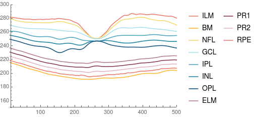
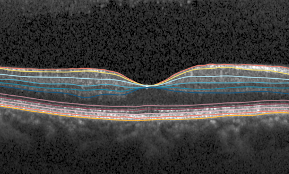
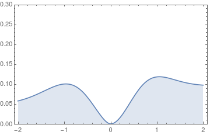
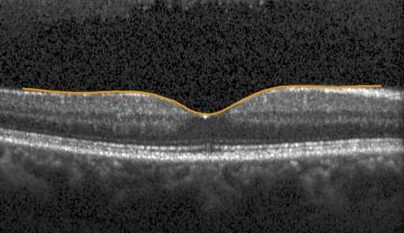
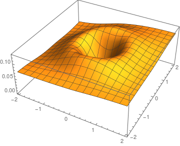
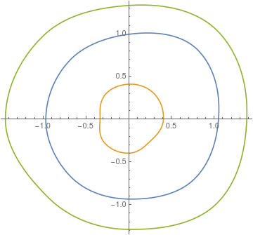
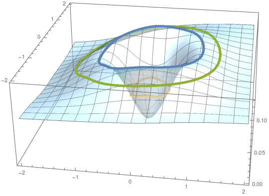

# Quantification of Foveal Shapes

This package provides algorithms to model and quantify foveal shapes from OCT scans.
Currently it supports raw-data files from the Spectralis SD-OCT (Heidelberg Engineering) and it requires the 
Mathematica import package from the [spectralis-raw-data repository](https://github.com/halirutan/spectralis-raw-data).
Note that the code here was extracted from a larger project.
Although I have tested it carefully, it is possible that it doesn't behave as expected.

The work around fovea modelling was published in or relied on the following articles:


-  **Patrick Scheibe**, Anfisa Lazareva, Ulf-Dietrich Braumann, Andreas Reichenbach, Peter Wiedemann, Mike Francke and Franziska Georgia Rauscher, **Parametric model for the 3D reconstruction of individual fovea shape from OCT data**, Experimental Eye Research, 19-26, (2014), [10.1016/j.exer.2013.11.008](https://doi.org/10.1016/j.exer.2013.11.008)
([download pdf](/images/download/paper/exer2014.pdf))
-  **Patrick Scheibe**, Maria Teresa Zocher, Mike Francke, Franziska Georgia Rauscher, **Analysis of foveal characteristics and their asymmetries in the normal population**, Experimental Eye Research, Volume 148, (2016), [DOI:10.1016/j.exer.2016.05.013](http://dx.doi.org/10.1016/j.exer.2016.05.013).
([download pdf](/images/download/paper/exer2016.pdf))
- Katharina Frey, Beatrice Zimmerling, **Patrick Scheibe**, Franziska G Rauscher, Andreas Reichenbach, Mike Francke, Robert Brunner, **Does the foveal shape influence the image formation in human eyes?**, Advanced Optical Technologies, Volume 6, Issue 5, 403-410, (2017), open source, [10.1515/aot-2017-0043](https://doi.org/10.1515/aot-2017-0043)
- Marcus Wagner, **Patrick Scheibe**, Mike Francke, Beatrice Zimmerling, Katharina Frey, Mandy Vogel, Stephan Luckhaus, Peter Wiedemann, Wieland Kiess, Franziska G. Rauscher, **Automated detection of the choroid boundary within {OCT} image data using quadratic measure filters**, Journal of Biomedical Optics, Volume 22, Issue 2, (Feb. 2017), [10.1117/1.jbo.22.2.025004](https://doi.org/10.1117/1.jbo.22.2.025004)
- Albert Rich, **Patrick Scheibe** and Nasser Abbasi, **Rule-based integration: An extensive system of symbolic integration rules**, Journal of Open Source Software, Volume 3, Issue 32, (Dec. 2018), [10.21105/joss.01073](https://doi.org/10.21105/joss.01073)

# Extended Example

This code should run in Mathematica version 11.3 or later. You need to download the Mathematica package for importing
[Spectralis SD-OCT files (HSF)](https://github.com/halirutan/spectralis-raw-data) and this repository.
Make both package available either by placing them into the Applications directory of your `$UserBaseDirectory` or adding the paths with `PacletDirectoryAdd`.

```mathematica
<< HSF`
<< FoveaAnalysis`
```

A test-scan can be found in the `Example` directory of this repository which also contains a notebook for this
example.

```mma
file = "layers.vol";
```

## Inspect the OCT raw-data file

To model the fovea from an OCT file, it is necessary to calculate a retinal thickness map from the volume scan.
Here, we use the automatically extracted retinal layers provided by the Spectralis SD-OCT for this purpuse.
Make sure, you have the inner limiting membrane (ILM) and the retinal pigment epithelium (RPE) available.
In older Spectralis file versions, the RPE is actually Bruch's membrane (BM).

A test-scan can be found in the `Example` directory of this repository.
For this example file, we have several layers available

```mma
HSFLayerSegmentation[file, 50] // Keys

(* 
{"ILM", "BM", "NFL", "GCL", "IPL", "INL", "OPL", "ONL", "ELM", "IOS", "OPT", "CHO", "VIT", "ANT", "PR1", "PR2", "RPE"}
*)
```

We can visualize available retinal layers with

```mma
info = HSFInfo[file];
scanNumber = 49;
nz = info["SizeZ"];
bscan = HSFBScanImage[file, scanNumber];
layer = HSFLayerSegmentation[file, scanNumber];
layer = DeleteCases[layer, {$HSFInvalid ..}];

ListLinePlot[Evaluate[nz - # & /@ (Values[layer])], 
 PlotLegends -> Keys[layer], PlotStyle -> ColorData[24], 
 PlotRange -> {Automatic, {150, 300}}]
```



The fovea modelling uses the ILM and the RPE layer to calculate the retinal thickness map of the entire volume scan.
It's also possible to map the layers back onto the B-scan

```mma
ImagePad[
 HighlightImage[
  HSFBScanImage[file, scanNumber],
  ListLinePlot[Evaluate[nz - # & /@ (Values[layer])], 
   PlotStyle -> ColorData[24], PlotRange -> {Automatic, {150, 300}}]
  ], {{-10, -10}, {-100, -100}}
 ]
 ```
 
 
 
 ## Fovea Modelling
 
For successful modelling, the OCT file needs to contain a retinal scan of the fovea which should be located
roughly in the center of the scan.
Furthermore, it is essential that the RPE and ILM were successfully extracted in the foveal region.
If the vol file is of sufficient quality, the first step is to find the foveal center.
A simple algorithm is available in the package

```mma
cent = FindFoveaCenter[file]

(* <|"Center" -> {49, 263}, "CentralPixelHeight" -> 54.7503|> *)
```

The path to the vol-file, the center and the retinal thickness at the center are the essential information for fitting
the fovea model.
Other settings can either be adjusted through Options or provided directly in the association that also includes
the foveal center.

```mma
Options[FindFoveaModelParameters]//Column

(*
    PropertiesPath->Automatic
    ParameterRanges->{{0.01,12.},{0.01,2.},{1.,10.},{-1,1}}
    AngleStepSize->\[Pi]/2
    MaxRadius->2.
    PreferPropertyFile->False
    InitialPoints->Automatic
    OCTPath->Automatic
*)
```

Let us model only the two main directions which is `phi=0` and `phi=Pi` and which correspond to right and left side
of the fovea through the central B-scan

```mma
result = FindFoveaModelParameters[file, cent, "AngleStepSize" -> Pi]

(*
     <| "Center" -> {49, 263},
        "CentralPixelHeight" -> 54.7503, 
        "Parameters" -> {{1.56819, 0.360166, 1.92116, 0.0955628}, {1.33547, 0.431375, 1.67973, 0.047267}}, 
        "Errors" -> {5.30394*10^-6, 4.50641*10^-6}, 
        "AngleStepSize" -> 3.14159,
        "MaxRadius" -> 2., 
        "ParameterRanges" -> {{0.01, 12.}, {0.01, 2.}, {1., 10.}, {-1, 1}} |>
*)
```

The function `FindFoveaModelParameters` returns the parameters, the fit-errors and other properties.
In this simple case, we can build a function to plot the modelled fovea left to right by using the two returned parameter
sets:

```mma
modelFunc[r_] := Piecewise[{{FoveaModel[parms[[1]], r], r >= 0}, {FoveaModel[parms[[2]], -r], r < 0}}, 0]

Plot[modelFunc[r], {r, -2, 2}, 
    PlotRange -> {Automatic, {0, .3}}, 
    AspectRatio -> 1/GoldenRatio,
    Frame -> True, 
    Axes -> False, 
    Filling -> Axis
]
```



### Projection onto the B-scan

For the projection onto the corresponding central B-scan, the coordinate-system needs to be converted to pixel-coordinates.

```mathematica
Module[
    {
        info = HSFInfo[file], 
        crtmin = result["CentralPixelHeight"],
        scaleX, 
        scaleZ,
        cx, cy, ip
    },
    scaleX = info["ScaleX"];
    scaleZ = info["ScaleZ"];
    {cy, cx} = result["Center"];
    ip = ListInterpolation[HSFLayerSegmentation[file, cy]["RPE"]];
    ImagePad[
        HighlightImage[
        HSFBScanImage[file, cy],
        Plot[
            modelFunc[(r - cx)*scaleX]/scaleZ + crtmin + (info["SizeZ"] - ip[r]),
            {r, 30, info["SizeX"] - 30},
            PlotStyle -> Directive[Thickness[0.005], Opacity[0.9, ColorData[97, 2]]]
        ]], {{0, 0}, {-100, -100}}
    ]
]
```



### Three-dimensional modelling

When several directions around the foveal centre are modelled, a 3D representation of the entire fovea can be reconstructed.
In this example, we use `nd=8` equally distributed directions.

```mma
nd = 8;
dPhi = 2 Pi/nd;

result = FindFoveaModelParameters[file, cent, "AngleStepSize" -> dPhi];
parms = result["Parameters"];
```

We use the calculated parameter sets to create interpolating functions for each parameter so that we can access, e.g.
`muf[phi]` for the whole polar interval `0<=phi<2Pi`

```mma
{muf, sigmaf, gammaf, alphaf} = SteffenInterpolation[
    Transpose[{Range[0, 2 Pi, dPhi], Append[#, First[#]]}], 
    PeriodicInterpolation -> True] & /@ Transpose[parms];
```

The interpolated parameters can now be employed to reconstruct the foveal surface in Cartesian coordinates.

```mma
fovF[{x_, y_}] := With[
    {
        r = Sqrt[x^2 + y^2],
        phi = If[x == 0 && y == 0, 0.0, ArcTan[x, y]]
    },
    FoveaModel[{muf[phi], sigmaf[phi], gammaf[phi], alphaf[phi]}, r]
];


plotSurf = Plot3D[fovF[{x, y}], {x, -2, 2}, {y, -2, 2},
  Exclusions -> None,
  PlotPoints -> 30
]
```



### Foveal Characteristics

As described in the publications, one application is the extraction of foveal characteristics from the model.
With these characteristics, foveas can be quantified using intuitive properties like height of the foveal rim, slope,
foveal radius, etc.
Below we use the foveal rim, the point of max slope inside the foveal pit,
and the turning point outside the fovea to show the asymmetry of the foveal pit

```mma
Function[{name, characteristic}, 
    name[phi_?NumericQ] := FoveaCharacteristic[
        characteristic][muf[phi], sigmaf[phi], gammaf[phi], alphaf[phi]]
    ] @@@ {{rim, "MaximumPoint"}, {turn1, "TurningPoint1"}, {turn2, "TurningPoint2"}};

PolarPlot[
    {First@rim[phi], First@turn1[phi], First@turn2[phi]},
    {phi, 0, 2 Pi}
]
```



It is simple to map these radii back onto the foveal surface.

```mma
map3D[charact_, phi_?NumericQ] := Module[{r, h},
  {r, h} = charact[phi];
  {r*Cos[phi], r*Sin[phi], h*1.01}
  ]

Show[
 Plot3D[fovF[{x, y}], {x, -2, 2}, {y, -2, 2},
  Exclusions -> None,
  PlotPoints -> 100,
  PlotStyle -> Opacity[0.5, ColorData[97, 7]],
  Lighting -> "Neutral"
  ],
 ParametricPlot3D[{map3D[rim, phi], map3D[turn1, phi], 
   map3D[turn2, phi]}, {phi, 0, 2 Pi}, 
  PlotStyle -> Directive[Thickness[0.01], ColorData[97]]]
 ]
```

